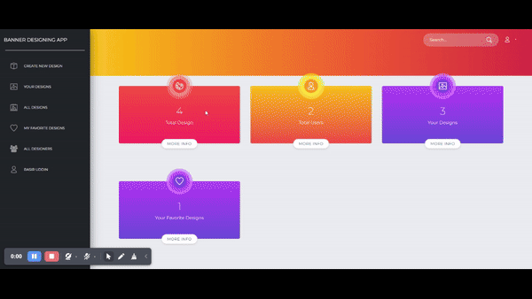

<br/>
<p align="center">
  <a href="https://github.com/basirkhan12/Graphic-and-banner-designing-app-fabricjs">
    
  </a>

  <h3 align="center">Banner Designing APP - Canva Clone</h3>

  <p align="center">
    The Graphic and Banner Designing App powered by Fabric.js is a versatile web application designed to empower users to unleash their creativity in graphic and banner design. Whether you're a seasoned designer or a beginner, our app provides an intuitive and feature-rich environment for crafting stunning visuals.
    <br/>
    <br/>
    <a href="http://banner-designing.unclewebsite.com/">View Demo</a>
    .
    <a href="https://github.com/basirkhan12/Graphic-and-banner-designing-app-fabricjs/issues">Report Bug</a>
    .
    <a href="https://github.com/basirkhan12/Graphic-and-banner-designing-app-fabricjs/issues">Request Feature</a>
  </p>
</p>

   

## Table Of Contents

* [About the Project](#about-the-project)
* [Built With](#built-with)
* [Getting Started](#getting-started)
  * [Prerequisites](#prerequisites)
  * [Installation](#installation)
* [Usage](#usage)
* [Roadmap](#roadmap)
* [Contributing](#contributing)
* [License](#license)
* [Authors](#authors)

## About The Project




## Built With

* Laravel: A powerful PHP framework for building robust web applications.
* Fabric.js: A powerful and flexible JavaScript library for working with HTML5 canvas.
* MySQL: A relational database for storing and managing application data.


## Getting Started

This is an example of how you may give instructions on setting up your project locally.
To get a local copy up and running follow these simple example steps.

### Prerequisites

The following dependencies  are required on your sever or pc.

* PHP 7.3
* Laravel 8
* Modern web browser (Chrome, Firefox, Safari, etc.)


### Installation

 > download the project
 ```
 $ git clone https://github.com/basirkhan12/Graphic-and-banner-desinging-app-fabricJs.git
 ```
 > then Install the dependencies using composer
 ```
$ composer install
 ```
> conntect your datebase to project using .ENV file 
 ```
DB_CONNECTION=mysql
DB_HOST=localhost
DB_PORT=3306
DB_DATABASE=bannerapp
DB_USERNAME=root
DB_PASSWORD=
 ```
 > Migrate the data 
 ```
 $ php artisan migrate
 ```
 >create storage link in public file
 ```
 $ php artisan storage:link
 ```

 >add javascript dependencies 
 ```
 $ npm install
 ```

 
 >now you can run your project 
 ```
 $ php artisan serve
 ```

## License

The Laravel framework is open-sourced software licensed under the [MIT license](https://opensource.org/licenses/MIT).


## Usage

Explore the user-friendly interface, experiment with tools, and turn your creative ideas into visually stunning graphics and banners.


## Roadmap

See the [open issues](https://github.com/basirkhan12/Graphic-and-banner-designing-app-fabricjs/issues) for a list of proposed features (and known issues).

## Contributing

Contributions are what make the open source community such an amazing place to be learn, inspire, and create. Any contributions you make are **greatly appreciated**.
* If you have suggestions for adding or removing projects, feel free to [open an issue](https://github.com/basirkhan12/Graphic-and-banner-designing-app-fabricjs/issues/new) to discuss it, or directly create a pull request after you edit the *README.md* file with necessary changes.
* Please make sure you check your spelling and grammar.
* Create individual PR for each suggestion.
* Please also read through the [Code Of Conduct](https://github.com/basirkhan12/Graphic-and-banner-designing-app-fabricjs/blob/main/CODE_OF_CONDUCT.md) before posting your first idea as well.

### Creating A Pull Request

1. Fork the Project
2. Create your Feature Branch (`git checkout -b feature/AmazingFeature`)
3. Commit your Changes (`git commit -m 'Add some AmazingFeature'`)
4. Push to the Branch (`git push origin feature/AmazingFeature`)
5. Open a Pull Request

## License

Distributed under the MIT License. See [LICENSE](https://github.com/basirkhan12/Graphic-and-banner-designing-app-fabricjs/blob/main/LICENSE.md) for more information.

## Authors

* **Basir khan** - *software engineer * - [Basir khan](https://github.com/basirkhan12/) - *Built banner design app*
